# ファーウェイWear Engine SDK
Wear Engine SDKはファーウェイが提供している通信ライブラリです。Android・iOSとファーウェイのスマートウォッチにWear Engine SDKを実装すれば、アプリ間の通信ができるようになります。例えば、スマホがファーウェイウォッチにテキストを送り、ファーウェイウォッチがそれを表示する、スマホがファイルをファーウェイウォッチに送り、ウォッチが受信する、といったことが実現できるようになります。

## 実装手順
### 前準備
1. AppGallery Connectの[Development and services]でプロジェクトを作成します。
2. 作成したプロジェクトにアプリを追加します。
AndroidとiOSの場合、[Add app]ボタンでアプリを追加できます。
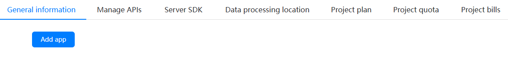
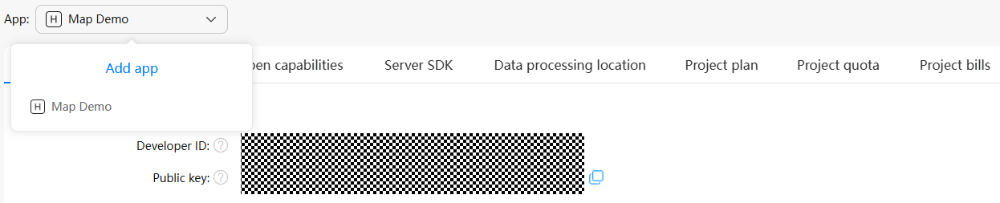
WearableとLite Wearableの場合、[Certificates, app IDs, and profiles]の[App IDs]でアプリを追加できます。
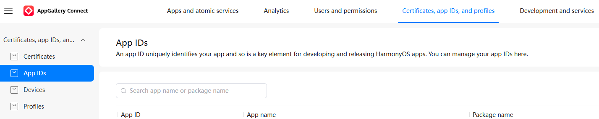

3. [Certificates, app IDs, and profiles]の[Certificates]で、証明書を追加します。
4. [Certificates, app IDs, and profiles]の[Devices]で、デバッグに使うデバイスのUDIDを追加します。UDIDはHUAWEI DevEco Assistantアプリで確認できます。
5. [Certificates, app IDs, and profiles]の[Profiles]で、プロファイルを作成します。

### Android
* build.gradle.ktsのdependenciesに
```
implementation("com.huawei.hms:wearengine:[バージョン]")
```
を追加します。[バージョン](https://developer.huawei.com/consumer/cn/doc/connectivity-Guides/version-change-history-0000001086350238)について[https://developer.huawei.com/consumer/cn/doc/connectivity-Guides/version-change-history-0000001086350238](https://developer.huawei.com/consumer/cn/doc/connectivity-Guides/version-change-history-0000001086350238)をご参照ください。
* proguard-rules.proに下記のコードを追加します。
```
-keepattributes *Annotation*
-keepattributes Signature
-keepattributes InnerClasses
-keepattributes EnclosingMethod
-keep class com.huawei.wearengine.**{*;}
```
* AndroidManifest.xmlで次の権限を宣言をします。
```xml
<manifest>

    <!-- Android 11以上の場合は以下を追加する必要がある -->
    <queries>
        <package android:name="com.huawei.health" />
    </queries>

    <!-- Android 12L (API level 32) 以下  -->
    <uses-permission android:name="android.permission.READ_EXTERNAL_STORAGE" android:maxSdkVersion="32" />

    <!-- Android 13 (API level 33) 以上 -->
    <uses-permission android:name="android.permission.READ_MEDIA_IMAGES" />
    <uses-permission android:name="android.permission.READ_MEDIA_VIDEO" />

    <!-- Android 14 (API level 34) 以上 -->
    <uses-permission android:name="android.permission.READ_MEDIA_VISUAL_USER_SELECTED" />

    <application>
        <!-- APP ID -->
        <meta-data
            android:name="com.huawei.hms.client.appid"
            android:value="[AndroidプロジェクトのApp ID]" />

        ...

    </application>

</manifest>
```
* [Android Studio]->[Project Structure]->[Signing Config]に署名を追加します。
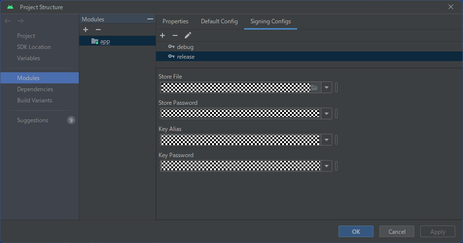
* ウォッチとの通信のサンプルコードは[オフィシャルサイト](https://developer.huawei.com/consumer/en/doc/connectivity-Guides/phone-send-message-0000001051059209)、またはこちらの[サンプルコード](https://github.com/Rei2020GitHub/WearEngineDemo/blob/main/Android/app/src/main/java/com/huawei/sample/wearable/demo/service/MainService.kt)をご参照ください。
* 通信を行うときに、P2pClientのsetPeerPkgName()でターゲットアプリのパッケージ名を設定しておき、さらにP2pClientのsetPeerFingerPrint()でフィンガープリントを設定しておく必要があります。例えば、Lite Wearable（Androidではない）にインストールされるアプリのパッケージ名がcom.huawei.sample.wearable.sportwatch.demoだとします。そうしたら、コードが次のようになります。
```kotlin
private lateinit var p2pClient: P2pClient
...
p2pClient = HiWear.getP2pClient(applicationContext)
...
p2pClient.setPeerPkgName("com.huawei.sample.wearable.sportwatch.demo")
```
通信ターゲットがWearableの場合、フィンガープリントがWearableにインストールされるアプリのApp IDです。
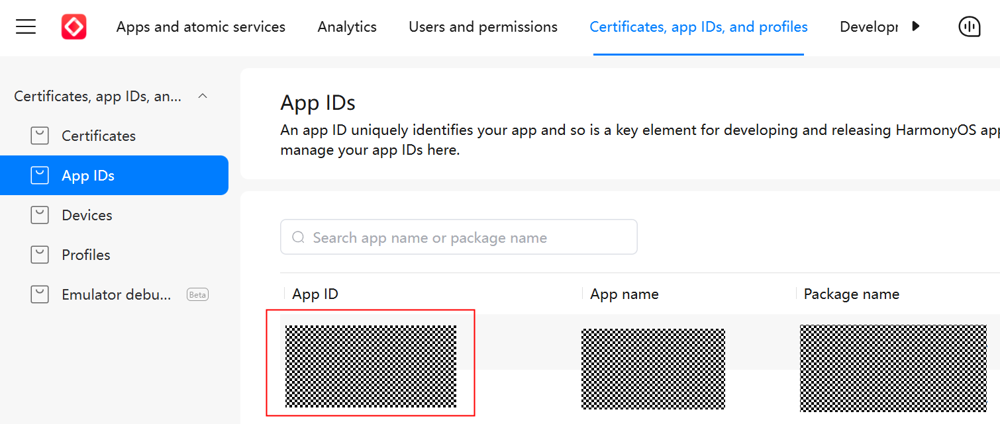
通信ターゲットがLite Wearableの場合、次の手順でフィンガープリントを生成します。
#### Lite Wearableのフィンガープリントの生成手順
1. AppGallery ConnectでLite Wearableで使用するcerファイルをダウンロードし、開きます。
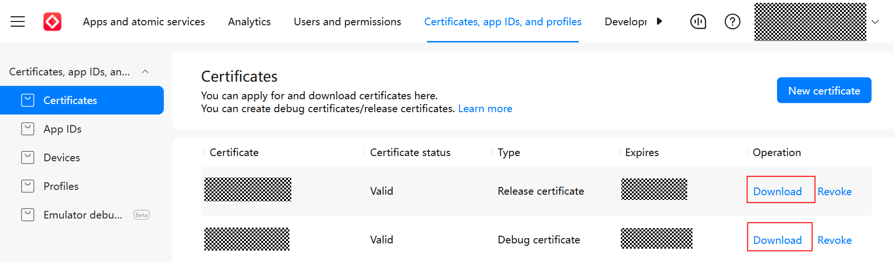
2. 最後のBEGIN CERTIFICATEのブロックをコピーし、新しいファイル（たとえば、xxx.cerなど）を作成し、そこに貼り付けます。
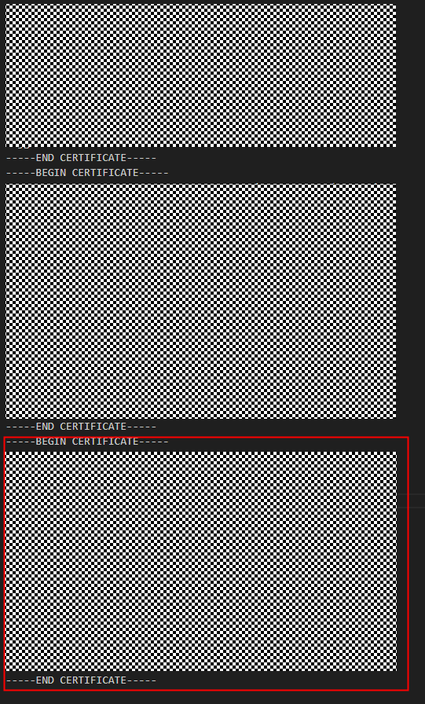
3. そのファイルを開き、[詳細]->[公開キー]の値をコピーします。
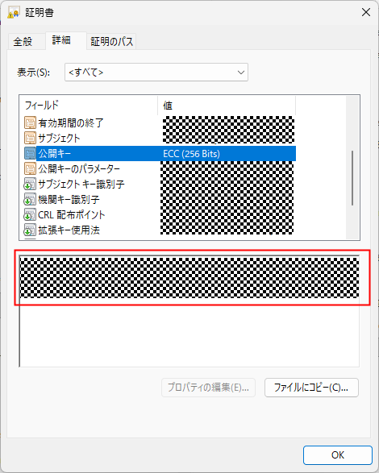
4. Base64のツール（[https://www.tomeko.net/online_tools/hex_to_base64.php](https://www.tomeko.net/online_tools/hex_to_base64.php)）を使い、その値をBase64に変換します。
5. フィンガープリント = [Lite wearable側のアプリのパッケージ名]_[公開キーのbase64の値]

### Lite Wearable
* [DevEco Studio]を起動し、[Create Project]ボタンをクリックし、[[Lite]Empty Ability]を選びます。
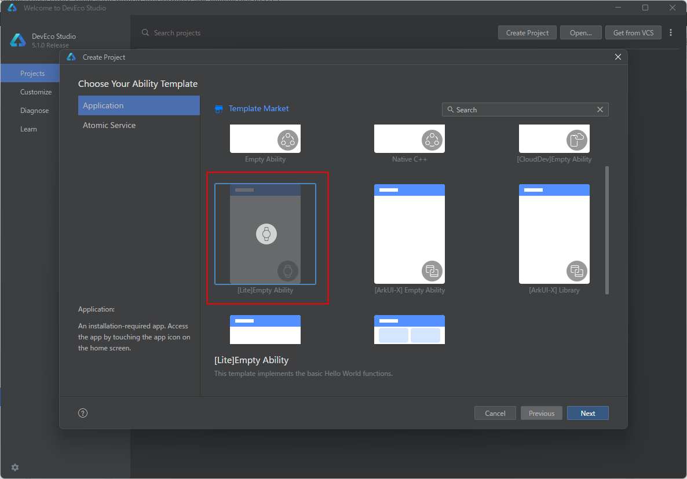
* Project nameなどを記入し、[Finish]ボタンをクリックします。
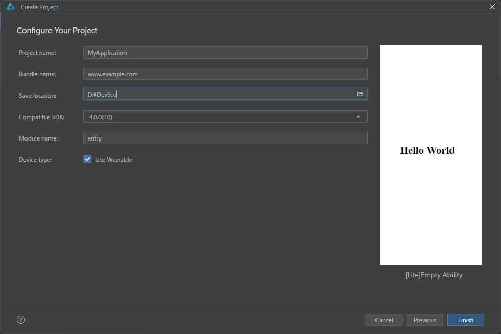
* [File]->[Project Structure]->[Signing Configs]を開き、署名を設定します。必ずAppGallery Connectで登録され、かつAndoirdプロジェクトでLite Wearableのフィンガープリントを生成する際に使用されたcerファイルを使わなければなりません。
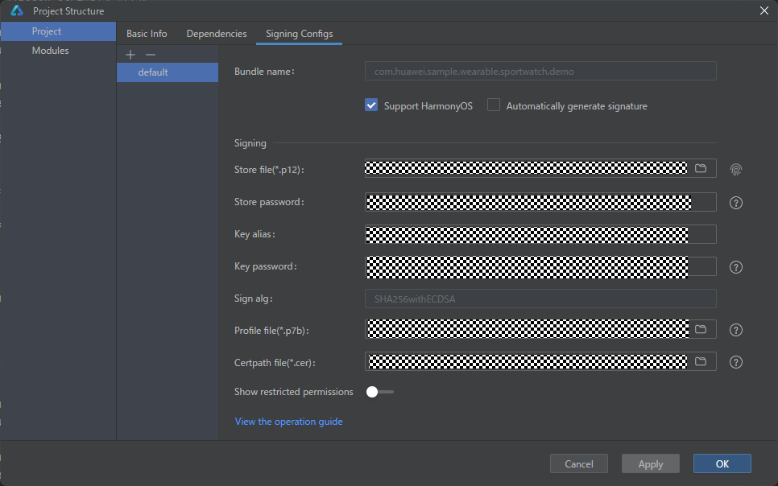
* [Wear Engine SDK (Lite Wearable Devices)](https://developer.huawei.com/consumer/en/doc/connectivity-Library/litewearable-sdk-cn-0000001705004353)からLite WearableのWear Engine SDKをダウンロードし、ファイルを解凍し、中のwearengine.jsをプロジェクトにコピーします。
* [オフィシャルサイト](https://developer.huawei.com/consumer/en/doc/connectivity-Guides/send-message-0000001052460491)、またはこちらの[サンプルコード](https://github.com/Rei2020GitHub/WearEngineDemo/blob/main/SportWatch/JS/entry/src/main/js/MainAbility/common/wearEngineManager.js)を参考に、機能を実装します。
* Lite WearableのWear Engineで使用するフィンガープリントは、Androidプロジェクトで使われるkeystoreファイル（jksファイル）に対して、次のコマンドで取得したSHA256の値になります。
```
keytool -list -v -keystore [jksファイル]
```
* Wear Engine SDKでは、コールバックを使う部分があります。jsのページで、コールバックで受け取った値を表示する際、コールバック関数の後ろに「.bind(this)」を追加しないと、値が反映されないことがあります。
```js
yourCallbackFunctionName() {
    return {
        onSuccess: function() {
        }.bind(this),
        onFailure :function() {
        }.bind(this),
        onReceiveMessage: function (data) {
        }.bind(this),
    }
},
```
* 画像は通常jpgやpngなどのフォーマットになりますが、Lite Wearableではjpgやpngを受信しても表示できません。画像をbinフォーマットに変換してから、Lite Wearableに送信する必要があります。binフォーマットについては後程説明します。

### Wearable
Wearableの開発に２つの方法があります。

１つ目はArkTS言語というHarmonyOS独自のプログラミング言語を使う方法です。２つ目はJavaScriptを使う方法です。

ArkTSを利用する場合、HarmonyOSのほぼすべての機能が使えます。しかし、Lite Wearableの開発ではArkTSが使えず、JavaScriptしか使えません。そのため、もしWearableとLite Wearableと両方の開発をする場合、コードのメンテナンスの観点からすれば、WearableでもLite Wearableと同じくJavaScriptを使って開発したほうが効率的だと思います。

#### Lite WearableのプロジェクトをWearableのプロジェクトに変換する手順
1. [DevEco Studio]を起動し、[Create Project]ボタンをクリックし、[[Lite]Empty Ability]を選びます（JavaScriptでWearableの開発をする場合、Lite Wearableと同じく[Lite]Empty Abilityを選ぶ）。

2. Project nameなどを記入し、Compatible SDKを5.0.0(12)に設定し、[Finish]ボタンをクリックします。
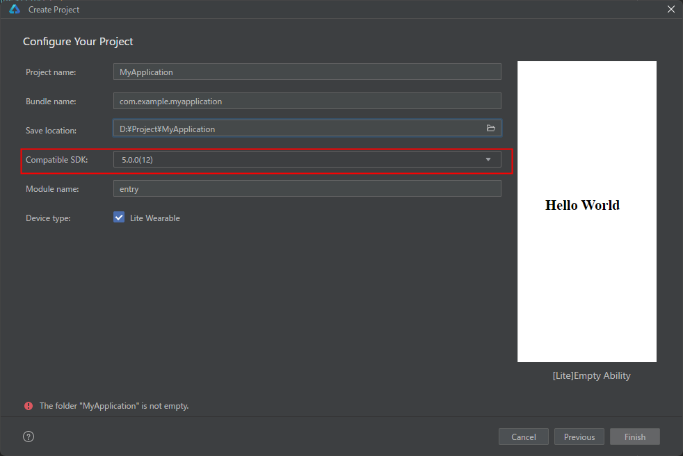
3. [File]->[Project Structure]->[Signing Configs]を開き、署名を設定します。必ずAppGallery Connectで登録された[Certificates]、[Profiles]を使わなければなりません。

4. プロジェクト名を右クリックし、[Module]をクリックします。
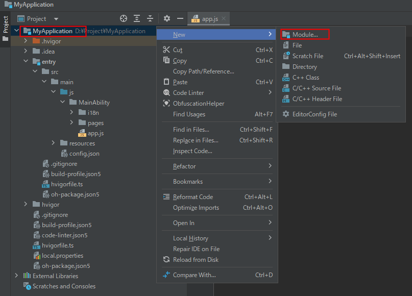
5. [Empty Ability]を選びます。
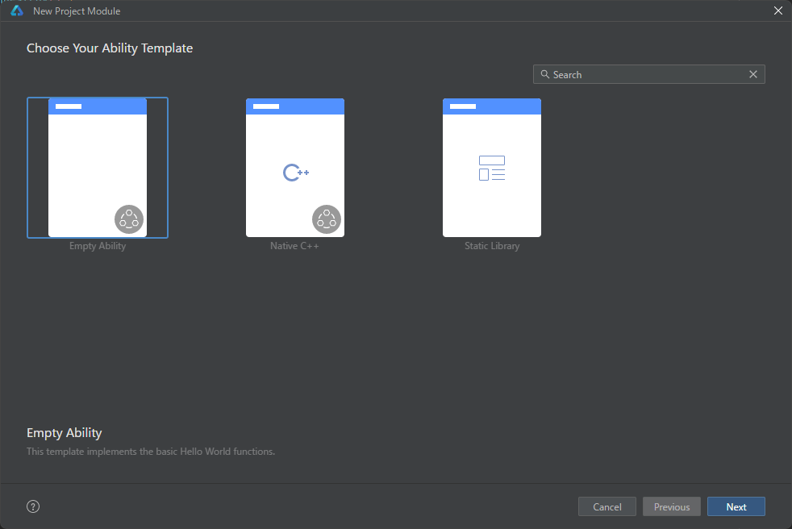
6. [Next]をクリックします。
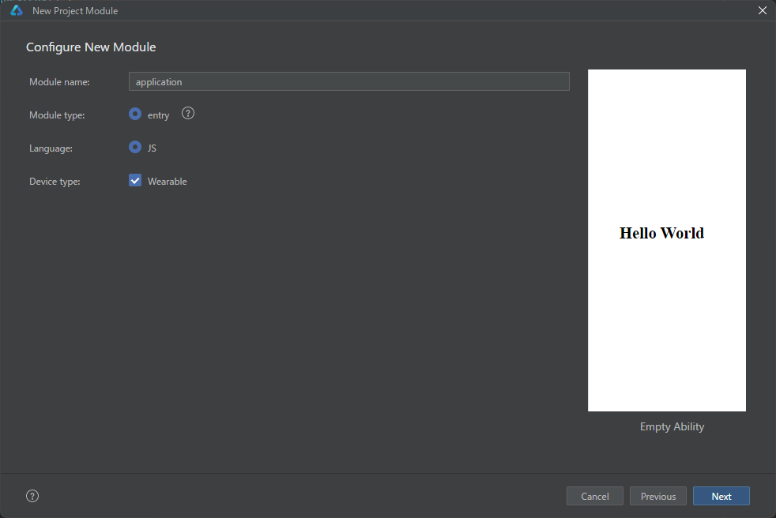
7. [Ability name]にHiWearMainAbilityを設定します。
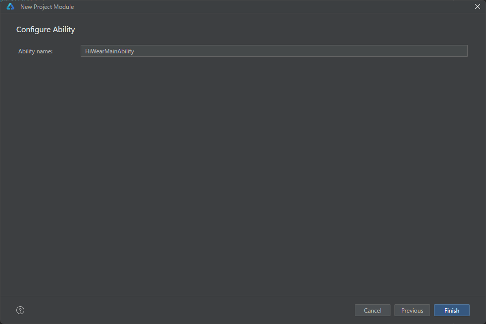
8. entryを削除します。
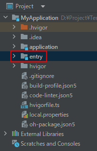
9. config.jsonにmetaDataを追加します。
```json
{
  ...
  "module": {
    ...
    "abilities": [
      ...
    ],
    "js": [
      ...
    ],
    "metaData": {
      "customizeData": [
        {
          "name": "wearEngineRemoteAppNameList",
          "value": "[スマホ側のアプリのパッケージ名]"
        }
      ]
    }
  }
}
```

#### Wearable開発のほかの注意点
* [Wear Engine SDK (Smart Wearable Devices)](https://developer.huawei.com/consumer/en/doc/connectivity-Library/wearable-sdk-cn-0000001656684902)からWearableのWear Engine SDKをダウンロードし、ファイルを解凍し、中のwearengine.jsをプロジェクトにコピーします。
* Wear Engine SDKでは、コールバックを使う部分があります。jsのページで、コールバックで受け取った値を表示する際、コールバック関数の後ろに「.bind(this)」を追加しないと、値が反映されないことがあります。
* ウォッチがファイルを受信したら、internal://app/[ファイル名]というファイルパスが渡されます。しかし、画像として表示するときに、絶対パスを指定しないと表示できません。次は変換方法の例です。
```js
import fileUri from '@ohos.file.fileuri';
import featureAbility from '@ohos.ability.featureAbility';
const context = featureAbility.getContext();

const convertInternalToAbsolute = async (internalPath) => {
    let filePath = await context.getFilesDir() + '/' + internalPath.replace('internal://app/', '');
    return fileUri.getUriFromPath(filePath);
}
```

### 画像変換
Lite Wearableでは通常のjpgやpngなどの画像ファイルが表示できません。jpgやpngなどの画像ファイルをbinフォーマットに変換する必要があります。変換方法は次の通りです。

1. [DevEco Studio]を起動し、[Create Project]ボタンをクリックし、[[Lite]Empty Ability]を選びます。

2. Project nameなどを記入し、[Finish]ボタンをクリックします。

3. 変換したいjpgファイルとpngファイルを entry\src\main\js\MainAbility\common にコピーします。
4. プロジェクトをビルドします（[Build] -> [Rebuild Project]）
5. binファイルが entry\build\default\intermediates\lite_source\default\assets\js\MainAbility\common の中に生成されます。

## サンプル（GitHub）
WearEngineDemo (https://github.com/Rei2020GitHub/WearEngineDemo)
## 参考資料
* Wear Engine - Android Phone App Development (https://developer.huawei.com/consumer/en/doc/connectivity-Guides/phone-dev-0000001086797354)
* Wear Engine - iOS Phone App Development (https://developer.huawei.com/consumer/en/doc/connectivity-Guides/phone-dev-ios-0000001874113366)
* Wearable App Development (JS) (https://developer.huawei.com/consumer/en/doc/connectivity-Guides/fitnesswatch-dev-0000001051423561)
* Applying for the Wear Engine Service (https://developer.huawei.com/consumer/en/doc/connectivity-Guides/applying-wearengine-0000001050777982)
* Lite Smart Wearables (https://developer.huawei.com/consumer/en/doc/best-practices/bpta-lite-wearable-guide)
* Wear Engine SDK (Mobile Phones) (https://developer.huawei.com/consumer/en/doc/connectivity-Library/phone-sdk-cn-0000001656844234)
* Wear Engine Reference (https://developer.huawei.com/consumer/en/doc/connectivity-References/api-description-0000001111724474)